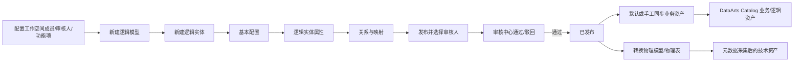

# 华为云 DataArts Studio“逻辑表”创建、管理与资产展示调研

> 调研日期：2026-08-31  
> 访问日期：2026-08-31  
> 证据范围：只采用华为云官网、华为云帮助中心、官方 API 参考和帮助中心所嵌官方页面截图。仓库既有 DOCX 与采集脚本仅用于发现 URL，不作为结论证据。  
> 产品术语：中文帮助中心的“数据架构”“数据目录”，在英文帮助中心分别对应 **DataArts Architecture** 与 **DataArts Catalog**。

## 1. 结论摘要

1. **华为云对通用“逻辑表”的正式对象名就是“逻辑实体”。** 官方原文明确写明“逻辑实体即逻辑表”。它在 **DataArts Architecture（数据架构）> 数据调研 > 逻辑建模 > 逻辑模型** 中创建，而不是在 DataArts Catalog 中创建。[逻辑模型（中文，更新时间 2026-08-13）](https://support.huaweicloud.com/intl/zh-cn/usermanual-dataartsstudio/dataartsstudio_01_0540.html)、[Logical Models（英文，更新时间 2026-08-21）](https://support.huaweicloud.com/intl/en-us/usermanual-dataartsstudio/dataartsstudio_01_0540.html)
2. **逻辑实体是业务语义对象，不等同于已落库物理表。** 它配置主题、名称/编码、属性、数据标准、主键/分区/非空、标签/密级、实体关系和属性映射；逻辑模型可再转换为关系建模中的物理模型。[逻辑模型](https://support.huaweicloud.com/intl/zh-cn/usermanual-dataartsstudio/dataartsstudio_01_0540.html)
3. **正式发布需要审批。** 创建者单击“发布”、选择审核人并提交；多审核人必须全部通过，任一驳回则为已驳回。审核人在“审核中心 > 待我审核”中通过或驳回并填写意见。企业模式还要选择发布到生产环境或开发环境。[逻辑模型](https://support.huaweicloud.com/intl/zh-cn/usermanual-dataartsstudio/dataartsstudio_01_0540.html)、[审核中心（更新时间 2025-04-08）](https://support.huaweicloud.com/intl/zh-cn/usermanual-dataartsstudio/dataartsstudio_01_0619.html)
4. **发布与进入资产目录通常连在一起，但不是同一个概念。** 默认配置勾选“同步业务资产”时，新逻辑实体发布后同步为 DataArts Catalog 的业务/逻辑资产；历史逻辑实体通过“更多 > 同步”补同步。只有已发布逻辑实体才能手工同步。[逻辑模型](https://support.huaweicloud.com/intl/zh-cn/usermanual-dataartsstudio/dataartsstudio_01_0540.html)
5. **资产页面必须区分两种表示。**
   - 业务资产：来自数据架构中已定义并发布的逻辑实体与数据表，围绕业务对象、逻辑实体、业务属性展示；
   - 技术资产：来自数据连接和元数据采集任务，围绕数据库、物理数据表、列、数据量、血缘、概要、预览等展示。  
   两者可有关联，但“逻辑实体业务资产详情”不能和“物理表技术资产详情”混称为同一个页面。[查看数据资产（更新时间 2026-08-17）](https://support.huaweicloud.com/usermanual-dataartsstudio/dataartsstudio_01_0809.html)、[元数据简介（更新时间 2025-12-05）](https://support.huaweicloud.com/intl/zh-cn/usermanual-dataartsstudio/dataartsstudio_01_0802.html)
6. **公开文档没有枚举当前业务资产列表的全部可见列，也没有给出“逻辑实体业务资产详情”当前页面的完整字段截图。** 官方 API 能证明资产记录中存在名称、英文名、编码、描述、责任/所有者、标签、分类、密级、关联物理表、业务属性、发布状态、工作空间及审计时间等数据，但 API 字段不能直接当成当前 UI 一定逐项展示的证明。[查询业务资产 API（更新时间 2026-07-02）](https://support.huaweicloud.com/intl/zh-cn/api-dataartsstudio/ShowBusinessAssets.html)

## 2. 证据分级

- **【官方事实】**：官方正文或 API 参考明确说明。
- **【页面观察】**：从官方帮助中心嵌入的产品页面截图直接读取；只说明截图可见内容，不扩大为所有版本/区域的一致行为。
- **【推断】**：由多项官方事实组合得到的产品理解，不宣称为官方原话。
- **【公开资料未证实】**：截至访问日，官方公开资料没有给出足够证据。

## 3. 正式对象与模块定位

### 3.1 对象映射

| 用户问题中的概念 | 华为云正式对象/模块 | 证据等级 | 说明 |
|---|---|---|---|
| 通用逻辑表 | **逻辑实体**（Logical Entity） | 官方事实 | 官方原文“逻辑实体即逻辑表”。 |
| 逻辑表容器 | **逻辑模型**（Logical Model） | 官方事实 | 逻辑模型用实体及其关系描述业务规则，并可转换为物理模型。 |
| 创建与管理模块 | **数据架构 / DataArts Architecture** | 官方事实 | 入口为数据调研 > 逻辑建模 > 逻辑模型。 |
| 资产消费/发现模块 | **数据目录 / DataArts Catalog** | 官方事实 | 发布/同步后的逻辑实体作为业务/逻辑资产进入目录。 |
| 落库表示 | **物理模型、物理表** | 官方事实 | 逻辑模型可转换到关系建模的物理模型；物理表再以技术资产形态被采集/展示。 |

主证据：[逻辑模型](https://support.huaweicloud.com/intl/zh-cn/usermanual-dataartsstudio/dataartsstudio_01_0540.html)、[Logical Models](https://support.huaweicloud.com/intl/en-us/usermanual-dataartsstudio/dataartsstudio_01_0540.html)、[数据架构概述（更新时间 2026-05-12）](https://support.huaweicloud.com/usermanual-dataartsstudio/dataartsstudio_01_0601.html)

### 3.2 不应混淆的其他“逻辑表”

【官方事实】DataArts Architecture 的维度建模、数据集市还存在“事实逻辑表”“维度表”“汇总逻辑表”等专用建模对象；信息架构统一查看逻辑实体、物理表、维度表、事实表、汇总表。它们是特定建模方法下的对象，不应代替通用关系逻辑模型里的“逻辑实体”。[数据架构使用流程（更新时间 2026-05-12）](https://support.huaweicloud.com/usermanual-dataartsstudio/dataartsstudio_01_0541.html)、[数据架构概述](https://support.huaweicloud.com/usermanual-dataartsstudio/dataartsstudio_01_0601.html)

## 4. 创建、审批、发布、同步与使用全过程

### 4.1 前置条件

1. **审核人**：审核人必须先是当前工作空间成员并具有审核权限；在“数据架构 > 配置中心 > 审核人管理”添加。具有相应管理员角色/权限的用户才能添加审核人。[添加审核人（更新时间 2026-06-05）](https://support.huaweicloud.com/usermanual-dataartsstudio/dataartsstudio_01_0623.html)
2. **主题与逻辑模型**：逻辑实体必须属于主题，并位于一个逻辑模型中。逻辑模型字段为模型名称、前缀校验、描述；模型可编辑、删除、转换为物理模型，并可从逻辑实体/逻辑属性/标准覆盖率进入详情。[逻辑模型](https://support.huaweicloud.com/intl/zh-cn/usermanual-dataartsstudio/dataartsstudio_01_0540.html)
3. **配置中心**：数据架构流程要求先管理配置中心；“同步业务资产”“创建质量作业”等模型设计流程项会影响发布后的自动动作。[数据架构使用流程](https://support.huaweicloud.com/usermanual-dataartsstudio/dataartsstudio_01_0541.html)、[逻辑模型](https://support.huaweicloud.com/intl/zh-cn/usermanual-dataartsstudio/dataartsstudio_01_0540.html)
4. **按需准备**：数据标准、标签、密级可在相关治理模块先定义；手工创建纯逻辑实体本身不要求数据连接。只有逆向数据库、转换/落地物理模型时才需要数据连接、数据库以及特定引擎的队列/Schema。[逻辑模型](https://support.huaweicloud.com/intl/zh-cn/usermanual-dataartsstudio/dataartsstudio_01_0540.html)

### 4.2 页面入口与创建步骤

【官方事实】入口和顺序如下：

1. DataArts Studio 控制台选择工作空间，进入“数据架构”；
2. 左侧“数据调研 > 逻辑建模”，进入“逻辑模型”；
3. 新建或选择一个逻辑模型；
4. 进入逻辑实体管理页，单击“新建”；
5. 依次配置“基本配置”“逻辑实体属性”“关系”“映射”；
6. 单击“发布”，选择审核人并“确认提交”。

来源：[逻辑模型](https://support.huaweicloud.com/intl/zh-cn/usermanual-dataartsstudio/dataartsstudio_01_0540.html)

### 4.3 基本配置字段

| 官网原词 | 含义/规则 |
|---|---|
| 所属主题 | 从主题信息中选择。 |
| 逻辑实体编码 | 自动生成或自定义。 |
| 逻辑实体名称 | 业务名称；官方限制特定特殊字符和换行。 |
| 表英文名称 | 逻辑实体转换为物理表时的名称；可按命名词典翻译生成。 |
| 父逻辑实体 | 表达继承；父实体属性修改会影响继承它的子实体。 |
| 标签 | 用于资产分类和搜索，可从 DataArts Catalog 标签管理中选择/创建。 |
| 资产责任人 | 选择或输入责任人。 |
| 描述 | 1～200 字符。 |

【页面观察】官方“基本配置”截图可见四个页签“基本配置 / 逻辑实体属性 / 关系 / 映射”，并显示所属主题、逻辑实体编码（自动生成/自定义）、逻辑实体名称、表英文名称、父逻辑实体、标签、资产责任人、描述。[官方截图：基本配置](https://support.huaweicloud.com/intl/zh-cn/usermanual-dataartsstudio/zh-cn_image_0000001280977617.png)

### 4.4 逻辑实体属性字段

| 官网原词 | 含义/规则 |
|---|---|
| 名称 | 逻辑属性中文/业务名称。 |
| 英文名称 | 字母开头，只允许英文字母、数字、下划线。 |
| 编码 | 实体使用自定义编码时，属性也可自定义或自动生成。 |
| 数据类型 | 从字段类型中选择，可补充字段类型。 |
| 数据标准 | 关联已发布/可用的数据标准；可自动关联，官方写明一次最多 1000 个。 |
| 主键 | 标识主键；MRS Hudi 物理落地场景要求主键，否则同步失败。 |
| 分区 | 标识分区字段。 |
| 不为空 | 是否限制字段不能为空。 |
| 标签 | 属性级标签。 |
| 密级 | 属性级密级；可跳转 DataArts Security 创建。 |
| 描述 | 属性说明。 |

【官方事实】若配置中心勾选“创建质量作业”，属性关联数据标准后，逻辑实体发布会自动生成质量作业/质量规则，可在 DataArts Quality 的质量作业页查看。[逻辑模型](https://support.huaweicloud.com/intl/zh-cn/usermanual-dataartsstudio/dataartsstudio_01_0540.html)

【页面观察】属性页截图还可见“从数据标准导入”“自动关联数据标准”“数据标准稽核”“批量关联”“批量清空”等操作，以及关联逻辑属性、数据标准、主键、分区、不为空、标签、密级、描述、稽核状态等列；截图中的 `b`、`c` 列未被当前正文解释，不据此赋予产品含义。[官方截图：逻辑实体属性](https://support.huaweicloud.com/intl/zh-cn/usermanual-dataartsstudio/zh-cn_image_0000002308955533.png)

### 4.5 关系与映射

【官方事实】关系用于定义父/子逻辑实体之间的主外键和基数，配置项包括：关系名称、子逻辑实体、子逻辑实体属性 FK、子对父基数、父逻辑实体、父逻辑实体属性 PK、父对子基数、角色、操作。映射用于在源逻辑实体和目标逻辑实体之间建立属性对应；源可由多个逻辑实体组成，并配置 left/right/inner/outer JOIN 与 JOIN 属性，最后配置逻辑属性映射。[逻辑模型](https://support.huaweicloud.com/intl/zh-cn/usermanual-dataartsstudio/dataartsstudio_01_0540.html)

### 4.6 审核与发布状态

1. 创建者单击“发布”，选择一个或多个审核人，提交审核；
2. 企业模式选择生产或开发环境，默认生产，不选择环境无法发布；
3. 多审核人全部通过后状态才为“已发布”；任一审核人驳回则为“已驳回”；
4. 审核人员在“审核中心 > 待我审核”打开对象，选择“通过”或“驳回”并填写审核意见；支持批量审核；
5. 发起人可在“我的申请”查看或撤回申请；
6. “自助审批”会自动处理审批单，但官方把它标为体验功能，不推荐真实项目使用。

来源：[逻辑模型](https://support.huaweicloud.com/intl/zh-cn/usermanual-dataartsstudio/dataartsstudio_01_0540.html)、[审核中心](https://support.huaweicloud.com/intl/zh-cn/usermanual-dataartsstudio/dataartsstudio_01_0619.html)

### 4.7 发布后同步到 DataArts Catalog

【官方事实】系统默认在“配置中心 > 功能配置 > 模型设计业务流程步骤”勾选“同步业务资产”：

- 新建逻辑实体：单击“发布”可直接同步到 DataArts Catalog 的业务/逻辑资产；
- 历史已发布逻辑实体：列表上方“更多 > 同步”补同步；
- 手工“同步”只允许已发布逻辑实体；
- DataArts Catalog 中的业务资产随数据架构同步更新，但不会随源对象删除，需要在目录中手工定位并删除。

来源：[逻辑模型](https://support.huaweicloud.com/intl/zh-cn/usermanual-dataartsstudio/dataartsstudio_01_0540.html)、[查看数据资产](https://support.huaweicloud.com/usermanual-dataartsstudio/dataartsstudio_01_0809.html)

### 4.8 物理化与实际使用

【官方事实】逻辑模型可转换为关系建模中的既有物理模型。转换时配置：模型名称、是否更新已有表、物理表更新方式（不删除/删除多余字段）、数据连接类型、数据连接、数据库、全部/部分逻辑实体，以及引擎适用的队列、Schema、描述。也可从数据库逆向导入表形成逻辑实体，或通过 Excel、PowerDesigner 16.x LDM 导入。[逻辑模型](https://support.huaweicloud.com/intl/zh-cn/usermanual-dataartsstudio/dataartsstudio_01_0540.html)

【推断】因此逻辑实体有两条主要消费路径：一条作为业务语义资产被 DataArts Catalog 检索、理解和治理；另一条用于指导/生成物理模型，物理表再被开发、质量、血缘、权限和数据预览等技术能力消费。官方没有把“逻辑实体已发布”表述为“数据库中已自动建表”，两者不能画等号。

## 5. 发布后的管理能力

| 操作 | 官方约束/结果 |
|---|---|
| 同步 | 仅已发布逻辑实体可执行；同步业务资产到 DataArts Catalog。 |
| 发布 | 单个或批量；选审核人，审核通过后发布。 |
| 下线 | 仅已发布状态可下线。 |
| 修改主题 | 将逻辑实体移动到其他主题。 |
| 删除 | 仅草稿/已驳回/已下线状态可删除。 |
| 标签 | 最多 20 个；可按标签模糊过滤。 |
| 编辑 | 修改逻辑实体，并可关联质量规则；已发布对象再编辑会涉及“下展”语义。 |
| 查看 | 进入详情，在“表字段”配置异常数据输出、Where 条件、关联/清空质量规则。 |
| 发布历史 | 查看发布历史与版本对比。 |
| 预览 SQL | 预览逻辑实体 SQL 信息。 |
| 导入/导出 | Excel、PowerDesigner LDM 导入；表或 DDL 导出。 |
| 逆向数据库 | 从数据源导入数据库表形成逻辑实体，可查看失败原因并重试。 |

来源：[逻辑模型—逻辑实体更多操作](https://support.huaweicloud.com/intl/zh-cn/usermanual-dataartsstudio/dataartsstudio_01_0540.html)、[数据架构概述—信息架构](https://support.huaweicloud.com/usermanual-dataartsstudio/dataartsstudio_01_0601.html)

## 6. DataArts Catalog / 数据资产页面展示什么

### 6.1 资产总览与资产报告

【官方事实】“数据目录 > 数据地图 > 总览”分业务资产、技术资产、指标资产：

- 业务资产：展示业务对象、逻辑实体、业务属性的数量及详情；
- 技术资产：展示数据库、数据表、数据量的数量及详情；
- 指标资产：展示业务指标数量及详情；
- 资产报告：展示逻辑实体、数据表、资产关联、资产容量、标签、密级，以及 TOP100 表容量、表行数、桶容量等。

来源：[查看资产总览（更新时间 2026-06-05）](https://support.huaweicloud.com/usermanual-dataartsstudio/dataartsstudio_01_0808.html)

### 6.2 资产搜索与筛选

【官方事实】入口为“数据目录 > 数据地图 > 数据目录”，按“业务资产 / 技术资产 / 指标资产”页签搜索。支持：

- 按名称和描述搜索；
- 按所有属性搜索（官方解释为详情页展示的全部属性）；
- 模糊搜索、保存搜索条件、导入搜索条件；
- 对技术资产按数据连接、类型、标签、分类、密级筛选；选择类型 `Table` 查看表资产。

来源：[查看数据资产](https://support.huaweicloud.com/usermanual-dataartsstudio/dataartsstudio_01_0809.html)

### 6.3 逻辑实体业务资产：当前能确认的信息

| 信息 | 证据性质 | 能确认到的范围 |
|---|---|---|
| 业务资产类型 | 官方事实 | 业务对象与逻辑实体；API 查询类型含 `BUSINESS`、`LOGICENTITY`。 |
| 目录树 | 官方事实 | 业务对象分层节点下包含逻辑实体节点，至少返回逻辑实体 guid 与名称。 |
| 搜索结果 | 官方事实 | 以列表显示；可按名称/描述或所有属性检索。 |
| 资产标识 | 官方 API | guid、类型、显示名称、限定名称、编码、名称、英文名、描述。 |
| 治理属性 | 官方 API | owner/责任相关字段、标签、分类、密级/安全等级。 |
| 关联对象 | 官方 API | 关联物理表 `tables`、业务属性/字段 `fields`、关系属性。 |
| 状态与范围 | 官方 API | 发布状态、工作空间、实例/项目范围。 |
| 审计信息 | 官方 API | 创建人、更新人、创建时间、更新时间。 |

API 证据：[查询业务资产](https://support.huaweicloud.com/intl/zh-cn/api-dataartsstudio/ShowBusinessAssets.html)、[查询业务资产目录树](https://support.huaweicloud.com/intl/zh-cn/api-dataartsstudio/ShowBusinessAssetsTree.html)、[获取目录下逻辑实体（邀测，更新时间 2026-07-02）](https://support.huaweicloud.com/intl/zh-cn/api-dataartsstudio/ListLogicEntities.html)

> 【边界】上表中的“官方 API”只证明 DataArts Catalog 的接口模型/示例中存在这些信息，不证明当前所有区域的 Web 详情页逐项、同名展示。特别是 `ListLogicEntities` 官方标题含“邀测”，不能当成所有租户均已开放的稳定 UI 能力。

### 6.4 技术表资产详情：官网正文与截图能确认的信息

【官方事实】以技术资产数据表为例，详情页具有：

- “详情”：技术元数据基本属性、描述、标签、密级；列/OBS 对象可配置分类、标签、密级；
- “权限”：申请表权限或给用户授权（部分区域能力已迁移到 DataArts Security）；
- “列属性”：列属性、分类、标签、密级、描述；
- “血缘”：血缘与影响；
- “概要”：DWS、DLI 表的采样概要；
- “数据预览”：DWS、DLI、Hive、HBase、MySQL；可按配置脱敏；
- “变更记录”：表变更详情。

来源：[查看数据资产](https://support.huaweicloud.com/usermanual-dataartsstudio/dataartsstudio_01_0809.html)

【页面观察】当前帮助页嵌入的官方表详情截图显示页签“详情 / 权限 / 列属性 / 血缘 / 概要 / 数据预览 / 变更记录”；“详情”中可见 `ddlCreateTime`、`database`、`schemaQName`、`alias`、`owner`、`lastAccessTime`、`createTime`、`location`、`tableType`、`dataLocation`、`tableSize`、`dataUpdateTime`、`comments`、`columnCount`、`name`、`ddlUpdateTime`，以及描述、分类、标签、密级。[官方截图：技术表详情](https://support.huaweicloud.com/usermanual-dataartsstudio/zh-cn_image_0000001122229521.png)

【页面观察】列属性截图可见“列、类型、已关联业务属性、分类、标签、密级、元数据描述、描述”等列。[官方截图：列属性](https://support.huaweicloud.com/usermanual-dataartsstudio/zh-cn_image_0000001122351375.png)

### 6.5 逻辑实体与技术表在资产页的关系

【推断】对竞品页面设计，华为云的核心做法不是把所有信息压进一张“逻辑表”卡片，而是保留两类资产视角：

- 逻辑实体业务资产承载业务名称、责任、描述、业务属性、标准/标签/密级与关联物理表；
- 技术表资产承载数据源、库表列、容量、权限、血缘、概要、预览和变更。

这一区分由官方的业务/技术元数据定义、同步来源和不同详情能力共同支持；但“一个逻辑实体是否在当前 UI 中以固定按钮跳转到所有关联技术表”在公开资料中未被明确说明。

### 6.6 权限申请与下游使用

【官方事实】**能搜索/查看资产元数据不等于已经获得底层数据访问权。** 当前“查看数据资产”文档在技术表详情的“权限”页签说明可申请数据表权限或给其他用户授权；已上线 DataArts Security 的区域，申请/授权由数据安全组件提供，数据目录内的旧权限能力仅供存量用户并处于待下线状态。[查看数据资产](https://support.huaweicloud.com/usermanual-dataartsstudio/dataartsstudio_01_0809.html)、[数据权限简介（待下线，更新时间 2025-02-21）](https://support.huaweicloud.com/usermanual-dataartsstudio/dataartsstudio_01_0826.html)

当前 DataArts Security 的公开流程是：

1. 管理员先配置工作空间的空间权限集和审批策略；审批策略可按密级设置不同、多级审批流程；
2. 使用者进入“数据安全 > 访问权限管理 > 权限审批 > 权限申请”，单击“创建权限申请”；
3. 工单选择工作空间、空间权限集、数据源类型（公开页列为 Hive、DWS、DLI）、集群、数据连接和申请类型；库表列权限用于申请数据库、表或字段级访问；
4. 在资源树选择数据库和数据表，提交申请；该公开页当前说明实际申请粒度为数据表的 `SELECT` 权限，并要求空间权限集预先覆盖表中所有列；
5. 审批人在“权限审批”页查看工单，从业务合理性和数据安全角度通过或驳回；支持批量审批；
6. 审批通过后权限生效；管理员可在“权限回收”按工作空间、成员、库表查询并回收，也可调整有效期（取决于版本/规格）。

来源：[申请与审批权限（部分高级特性）](https://support.huaweicloud.com/usermanual-dataartsstudio/dataartsstudio_01_1159.html)、[访问权限管理流程](https://support.huaweicloud.com/usermanual-dataartsstudio/dataartsstudio_01_1151.html)

【官方事实】启用细粒度认证后，DataArts Factory（数据开发）执行脚本、测试运行作业或调度作业时，数据源使用当前用户身份鉴权，而不是共用数据连接账号，因此获批的库表权限会实际约束下游开发与调度。[访问权限管理流程](https://support.huaweicloud.com/usermanual-dataartsstudio/dataartsstudio_01_1151.html)

【边界】上述权限对象是物理库、表、列及引擎资源，不是给“逻辑实体定义”本身授予查询数据权限。公开资料未证明只对逻辑实体业务资产申请一次权限就能自动覆盖全部关联物理表；产品对比中应把“资产可见权、逻辑模型编辑/发布权、底层数据 SELECT 权”建模为不同权限。

## 7. 官方截图证据汇总

| 截图 | 可直接观察到的内容 | 不应扩大解释的内容 |
|---|---|---|
| [逻辑实体基本配置](https://support.huaweicloud.com/intl/zh-cn/usermanual-dataartsstudio/zh-cn_image_0000001280977617.png) | 四个编辑页签；主题、编码、名称、英文名、父实体、标签、责任人、描述 | 不证明所有区域字段顺序、默认值完全一致。 |
| [逻辑实体属性](https://support.huaweicloud.com/intl/zh-cn/usermanual-dataartsstudio/zh-cn_image_0000002308955533.png) | 属性列、标准、主键/分区/非空、标签、密级、稽核等 | 未解释的自定义列不赋予含义。 |
| [技术表资产详情](https://support.huaweicloud.com/usermanual-dataartsstudio/zh-cn_image_0000001122229521.png) | 技术元数据字段与详情页签 | 这是技术表，不是逻辑实体业务资产截图。 |
| [技术表列属性](https://support.huaweicloud.com/usermanual-dataartsstudio/zh-cn_image_0000001122351375.png) | 列、类型、关联业务属性、分类、标签、密级、描述 | 不证明逻辑实体属性页也采用相同列。 |

## 8. 公开资料未证实项

截至 2026-08-31，以下问题在已核验的官方公开页面中没有完整证据：

1. DataArts Catalog 当前 Web 页面中，“业务资产 > 逻辑实体”搜索结果的完整列名、默认排序和可自定义列清单；
2. 逻辑实体业务资产详情页的当前完整页签名、每个页签的精确字段顺序；
3. API 返回的每个字段是否都在 UI 展示，以及是否因区域、版本、组件上线情况而不同；
4. 从逻辑实体业务资产到关联技术表的当前 UI 跳转样式和按钮名称；
5. 未登录、无实例环境下无法核验的租户控制台实时页面差异。
6. 逻辑实体业务资产是否支持直接发起覆盖其全部关联物理表的组合权限申请。

因此，竞品对比表中应把“业务资产 UI 可见字段”拆成三栏：**官网正文明确**、**官方截图观察**、**官方 API 可用但 UI 未证实**，不能把三类证据合并为“页面已展示”。

## 9. 对产品设计可直接借鉴的点（推断）

1. 创建逻辑表时把基本信息、字段、关系、映射拆成四个清晰阶段；
2. 字段层直接关联标准、标签、密级，并把质量作业作为可配置的发布后动作；
3. 发布审批与资产同步解耦为两个状态，允许历史资产补同步；
4. 业务逻辑资产与物理技术资产分视角呈现，通过关联关系连接；
5. 管理页保留发布历史/版本对比、预览 SQL、同步、下线、标签、质量规则等运维入口；
6. 资产报告同时看逻辑实体数量、技术表数量、二者关联、容量与安全治理覆盖。

这些是基于华为云已公开事实形成的竞品设计理解，不是华为云官方给出的产品建议。

## 10. 一手来源登记

全部来源访问于 2026-08-31：

| 页面 | 官方更新时间 | 用途 |
|---|---:|---|
| [逻辑模型](https://support.huaweicloud.com/intl/zh-cn/usermanual-dataartsstudio/dataartsstudio_01_0540.html) | 2026-08-13 | 对象定义、创建字段、关系映射、发布同步、物理化、管理操作 |
| [Logical Models](https://support.huaweicloud.com/intl/en-us/usermanual-dataartsstudio/dataartsstudio_01_0540.html) | 2026-08-21 | 核对 DataArts Architecture / DataArts Catalog 英文正式模块名 |
| [数据架构使用流程](https://support.huaweicloud.com/usermanual-dataartsstudio/dataartsstudio_01_0541.html) | 2026-05-12 | 前置流程、逻辑/关系/维度/集市对象边界 |
| [数据架构概述](https://support.huaweicloud.com/usermanual-dataartsstudio/dataartsstudio_01_0601.html) | 2026-05-12 | 信息架构与统一管理操作 |
| [添加审核人](https://support.huaweicloud.com/usermanual-dataartsstudio/dataartsstudio_01_0623.html) | 2026-06-05 | 审核人角色和配置入口 |
| [审核中心](https://support.huaweicloud.com/intl/zh-cn/usermanual-dataartsstudio/dataartsstudio_01_0619.html) | 2025-04-08 | 通过/驳回、批量审核、我的申请 |
| [元数据简介](https://support.huaweicloud.com/intl/zh-cn/usermanual-dataartsstudio/dataartsstudio_01_0802.html) | 2025-12-05 | 业务资产与技术资产定义 |
| [查看资产总览](https://support.huaweicloud.com/usermanual-dataartsstudio/dataartsstudio_01_0808.html) | 2026-06-05 | 总览和资产报告信息 |
| [查看数据资产](https://support.huaweicloud.com/usermanual-dataartsstudio/dataartsstudio_01_0809.html) | 2026-08-17 | 搜索、筛选、技术表详情与官方截图 |
| [查询业务资产 API](https://support.huaweicloud.com/intl/zh-cn/api-dataartsstudio/ShowBusinessAssets.html) | 2026-07-02 | 逻辑实体搜索与业务资产数据字段 |
| [查询业务资产目录树 API](https://support.huaweicloud.com/intl/zh-cn/api-dataartsstudio/ShowBusinessAssetsTree.html) | 2026-07-02 | 业务对象层级和逻辑实体节点 |
| [获取目录下逻辑实体 API（邀测）](https://support.huaweicloud.com/intl/zh-cn/api-dataartsstudio/ListLogicEntities.html) | 2026-07-02 | 逻辑实体资产模型与示例字段；仅作邀测 API 证据 |
| [访问权限管理流程](https://support.huaweicloud.com/usermanual-dataartsstudio/dataartsstudio_01_1151.html) | 2026-02-10 | 库表权限模型与下游细粒度鉴权 |
| [申请与审批权限（部分高级特性）](https://support.huaweicloud.com/usermanual-dataartsstudio/dataartsstudio_01_1159.html) | 2026-07-29 | 权限申请、审批、回收流程与字段 |
| [数据权限简介（待下线）](https://support.huaweicloud.com/usermanual-dataartsstudio/dataartsstudio_01_0826.html) | 2025-02-21 | DataArts Catalog 旧权限能力的迁移边界 |
